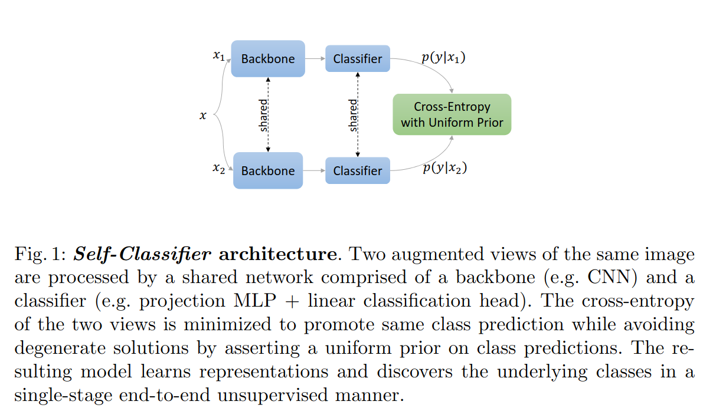

# Self-Classifier-experiments

[Self-Supervised Classification Network](https://arxiv.org/abs/2103.10994), released in 2021, introduced a new model called "Self-Classifier". 
Here in this project, I aim to perform the following:
- Produce a model replica or a model closer to the proposed model.
- Check for reproduciblity of atleast one or more experiments.
- Come up with hypothesis of my own and perform experiment(s).

## Quick Summary Self Classifier
Self-Classifier is a unsupervised machine learning model for image classification.
The model architecture:

